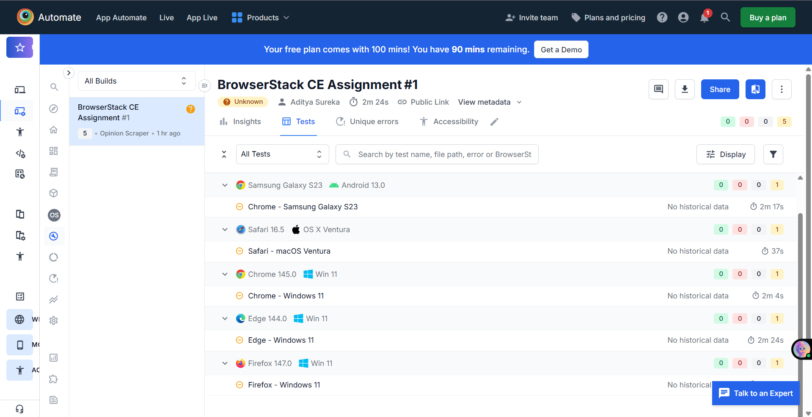
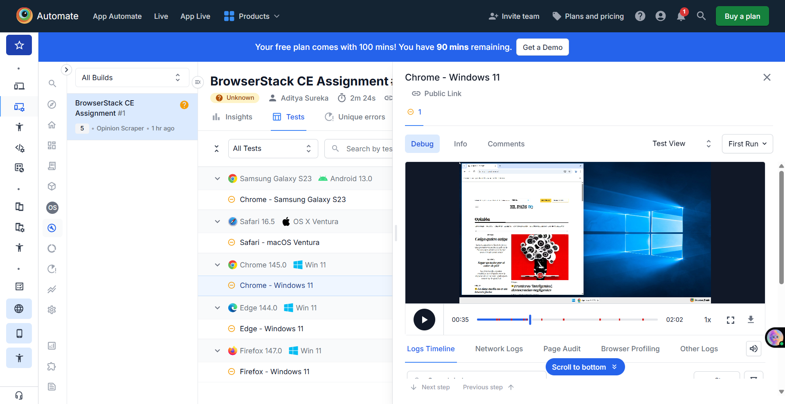

# BrowserStack Customer Engineering Assignment: Opinion Scraper

Cross-browser Selenium automation with parallel execution, API integration, and text analysis.

## 📋 Overview

This project demonstrates a complete end-to-end automation workflow combining web scraping, API integration, and cross-browser testing. The application:

- **Scrapes** the first 5 Opinion articles from [El País](https://elpais.com/) (Spanish news website)
- **Translates** Spanish article titles to English using Google Translate API
- **Analyzes** word frequency patterns across translated headers
- **Executes** the entire workflow in parallel across multiple browsers and devices using BrowserStack Automate

### Key Technologies Showcased

- Web scraping with Selenium WebDriver (W3C W3C compliant)
- API integration (Google Translate)
- Advanced text processing and analysis
- Cloud-based cross-browser testing
- Multithreaded parallel execution
- CI/CD ready automation

## 📑 Table of Contents

- [Project Overview](#overview)
- [Architecture & Design](#-architecture--design)
- [Tech Stack](#-tech-stack)
- [Features](#-features-implemented)
- [Installation & Setup](#-installation--setup)
- [Usage](#-usage)
- [Cross-Browser Execution](#-cross-browser-execution)
- [Challenges & Solutions](#-challenges-faced--solutions)
- [Sample Output](#-sample-output)
- [Security Practices](#-security-practices)
- [Project Structure](#project-structure)

## 🏗 Architecture & Design

The project follows a **modular, separation-of-concerns design pattern** for maintainability and scalability:

### Project Structure

```
BrowserStack-Task/
├── src/
│   ├── scraper.py              # Web scraping logic
│   ├── translator.py           # Translation API integration
│   ├── text_analyzer.py        # Word frequency analysis
│   ├── browserstack_runner.py  # Parallel execution orchestration
│   ├── config.py               # Environment configuration
│   └── __pycache__/
│
├── screenshots/                # Captured screenshots
├── images/                     # Downloaded article images
├── main.py                     # Entry point
├── requirements.txt            # Python dependencies
└── README.md                   # Project documentation
```

### Module Responsibilities

| Module | Purpose |
|--------|---------|
| **scraper.py** | Navigates El País Opinion section, extracts article metadata (title, preview, images), and downloads cover images |
| **translator.py** | Integrates with Google Translate API to convert Spanish titles to English |
| **text_analyzer.py** | Performs word frequency analysis, identifies repeated words (>2 occurrences) |
| **browserstack_runner.py** | Orchestrates parallel execution across multiple browsers using BrowserStack Remote WebDriver |
| **config.py** | Loads and validates environment variables securely using `python-dotenv` |

## ⚙ Tech Stack

| Category | Technology |
|----------|------------|
| **Language** | Python 3.11+ |
| **Browser Automation** | Selenium 4 (W3C WebDriver compliant) |
| **Cloud Testing** | BrowserStack Automate |
| **API Integration** | Google Translate (`googletrans`) |
| **Concurrency** | Python Threading |
| **HTTP Requests** | Requests library |
| **Configuration** | python-dotenv |

## ✨ Features Implemented

### Data Extraction
- ✅ Scrapes 5 Opinion articles from El País
- ✅ Extracts: title (Spanish), content preview, cover image
- ✅ Downloads images locally for offline reference

### Translation & Analysis
- ✅ Translates Spanish titles to English via Google Translate API
- ✅ Performs word frequency analysis
- ✅ Identifies repeated words (>2 occurrences)

### Cross-Browser Testing
Parallel execution across 5 different browser/device combinations:

| Browser | OS | Device |
|---------|----|---------| 
| Chrome | Windows 11 | Desktop |
| Firefox | Windows 11 | Desktop |
| Edge | Windows 11 | Desktop |
| Safari | macOS Ventura | Desktop |
| Chrome | Android 13 | Samsung Galaxy S23 |

### Execution & Reporting
- ✅ True parallel execution (5 concurrent threads)
- ✅ Programmatic session pass/fail reporting (BrowserStack Executor API)
- ✅ Thread-safe logging with thread identifiers
- ✅ Video recordings and network logs captured on BrowserStack

## 📦 Installation & Setup

### Prerequisites

- Python 3.11 or later
- BrowserStack account (for cloud execution)
- Internet connection

### Step 1: Clone/Setup Project

```bash
# Navigate to project directory
cd BrowserStack-Task
```

### Step 2: Install Dependencies

```bash
pip install -r requirements.txt
```

### Step 3: Configure Environment Variables

Create a `.env` file in the project root directory:

```env
BROWSERSTACK_USERNAME=your_browserstack_username
BROWSERSTACK_ACCESS_KEY=your_browserstack_access_key
```

**How to find your credentials:**
1. Log in to [BrowserStack](https://www.browserstack.com/)
2. Navigate to Settings → Automate
3. Copy your Username and Access Key

> ⚠️ **Security Note**: Never commit `.env` file to version control. It's included in `.gitignore` by default.

## 🚀 Usage

### Running on BrowserStack (Recommended)

Execute the parallel cross-browser automation:

```bash
python main.py
```

**What happens:**
1. Launches 5 parallel browser sessions on BrowserStack
2. Each session independently executes the scraping workflow
3. Sessions reported as Passed/Failed in the BrowserStack dashboard
4. Logs are collected per thread with clear identifiers
5. Video recordings and network traces stored in BrowserStack console

### Running Locally (Optional Testing)

To test the scraper logic on your local machine (commented out in `main.py`):

```python
# Uncomment the local_run() function in main.py and run:
python main.py
```

This will:
- Launch Chrome WebDriver locally
- Execute the scraping workflow
- Display results in console
- Save images to `images/` directory

## 🌍 Cross-Browser Execution

### Supported Configurations

The automation runs across these BrowserStack configurations for comprehensive coverage:

**Desktop Browsers:**
- Chrome (Windows 11)
- Firefox (Windows 11)
- Edge (Windows 11)
- Safari (macOS Ventura)

**Mobile:**
- Chrome (Samsung Galaxy S23, Android 13)

### How Parallel Execution Works

```
Thread 1: Chrome Win11    ─────────┐
Thread 2: Firefox Win11   ─────────┤
Thread 3: Edge Win11      ─────────┼──→ All sessions run simultaneously
Thread 4: Safari macOS    ─────────┤
Thread 5: Chrome Mobile   ─────────┘

Expected Runtime: ~60-90 seconds (vs 300+ seconds sequentially)
```

## 🔍 Cross-Browser Execution Evidence

All sessions are available in the BrowserStack Automate dashboard with:

- ✅ Video recording of each session
- ✅ Console logs and network activity
- ✅ HAR files for detailed network analysis
- ✅ Timeline visualization
- ✅ WebDriver capabilities metadata

### Build Overview

The following screenshot shows the complete BrowserStack build with all 5 parallel sessions:



### Session Debug View

Detailed session information including network logs, console outputs, and execution timeline:



## 🧠 Challenges Faced & Solutions

### Challenge 1: Click Interception

**Problem:** The Opinion navigation link was blocked by overlay elements, causing `ElementClickInterceptedException`.

**Solution:** 
- Implemented explicit waits using `WebDriverWait` with custom conditions
- Used JavaScript click execution as fallback: `driver.execute_script("arguments[0].click();", element)`
- Result: Reliable navigation across all browser configurations

### Challenge 2: Selenium 4 Capability Migration

**Problem:** Deprecated `desired_capabilities` dictionary in Selenium 4 caused compatibility issues.

**Solution:**
- Migrated to W3C-compliant Options object
- Used `options.set_capability()` for custom options
- Ensured compliance with modern WebDriver protocols

### Challenge 3: Stale Element Reference in Parallel Execution

**Problem:** DOM refresh after navigation caused `StaleElementReferenceException` when accessing article elements.

**Solution:**
- Collect article URLs first before navigation
- Navigate directly to URL rather than clicking elements
- Re-query DOM elements after each navigation
- Result: Stable element references across all threads

### Challenge 4: Thread-Safe Parallel Logging

**Problem:** Log outputs from 5 concurrent threads were interleaved and difficult to debug.

**Solution:**
- Implemented thread-name prefixing in log messages: `[Thread-Chrome-Win11]`
- Used threading locks for file I/O operations
- Separate log files per thread for detailed analysis
- Result: Clean, traceable logs per execution thread

## 📊 Sample Output

```
[INFO] Thread-Chrome-Win11: ✅ Session started
[INFO] Thread-Chrome-Win11: 📰 Scraped 5 articles from El País Opinion
[INFO] Thread-Chrome-Win11: 🔄 Translating titles...
[INFO] Thread-Chrome-Win11: 📝 Translated: "Opinión"
[INFO] Thread-Chrome-Win11: 🔍 Analyzing word frequency...
[INFO] Thread-Chrome-Win11: 
Repeated Words (> 2 occurrences):
  - opinion: 5 occurrences
  - política: 3 occurrences
[INFO] Thread-Chrome-Win11: ✅ Session marked as PASSED
```

## 🔒 Security Practices

✅ **Credential Management**
- Credentials stored securely using environment variables
- Sensitive data loaded via `python-dotenv`
- No hardcoded secrets in source code

✅ **Version Control Protection**
- `.env` file excluded via `.gitignore`
- Access keys never committed to repository
- Safe for public repository hosting

✅ **Best Practices**
- Uses official BrowserStack API endpoints (HTTPS)
- Validates environment variables before execution
- Fails safely if credentials are missing

## 🛠 Troubleshooting

### Issue: `BROWSERSTACK_USERNAME not found`

**Solution:** Verify `.env` file exists in project root with correct credentials:
```bash
cat .env  # Verify file contents
```

### Issue: Element not found / Click timeout

**Solution:** 
- Website structure may have changed
- Update element locators in `scraper.py`
- Check El País website for recent layout changes

### Issue: Translation fails

**Solution:** 
- Google Translate may be rate-limited
- Verify internet connection
- Check if googletrans version is `4.0.0-rc1`

### Issue: Parallel execution hangs

**Solution:** 
- Check BrowserStack account limits
- Verify concurrent session limits not exceeded
- Check network connectivity to `hub.browserstack.com`

## 📚 Project Structure

### Source Code Overview

**scraper.py** - Article extraction logic
```python
def scrape_articles(driver) -> List[dict]
    # Navigate to Opinion section
    # Extract article metadata (title, preview)
    # Download cover images
```

**translator.py** - Title translation
```python
def translate_titles(titles: List[str]) -> List[str]
    # Translate to English using Google Translate API
```

**text_analyzer.py** - Word frequency analysis
```python
def analyze_words(text_list: List[str]) -> dict
    # Find repeated words (>2 occurrences)
    # Return frequency map
```

**browserstack_runner.py** - Parallel execution
```python
def execute_parallel()
    # Create 5 concurrent threads
    # Each thread runs complete workflow
    # Report pass/fail to BrowserStack
```

## 🎯 Key Achievements

| Milestone | Status |
|-----------|--------|
| Web scraping with Selenium | ✅ Complete |
| API integration (Translation) | ✅ Complete |
| Text analysis (Word frequency) | ✅ Complete |
| Parallel execution (5 threads) | ✅ Complete |
| Cross-browser testing (5 configs) | ✅ Complete |
| BrowserStack integration | ✅ Complete |
| Programmatic reporting | ✅ Complete |
| Security best practices | ✅ Complete |

## 📝 Notes

- This project demonstrates Customer Engineering skills including automation, API integration, and cloud testing
- Designed to be modular and easily extensible
- Can be adapted for other websites and APIs
- Ready for CI/CD pipeline integration

## 🤝 Contributing

To extend this project:
1. Add new browser configurations in `browserstack_runner.py`
2. Extend `text_analyzer.py` for advanced NLP analysis
3. Add more news sources to `scraper.py`

## 📄 License

This project is provided as-is for assignment purposes.